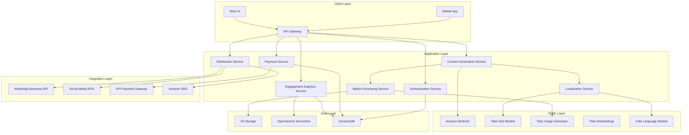

# Design Document: Vani-Bharat Platform

## Overview

The Vani-Bharat platform is built on a serverless, event-driven architecture leveraging AWS services to provide scalable, cost-effective AI-powered content orchestration for regional creators. The system uses Amazon Bedrock for generative AI capabilities, AWS Lambda for compute, Step Functions for workflow orchestration, and S3 for storage. The architecture is designed to handle intermittent connectivity, optimize for low-bandwidth environments, and scale automatically based on demand.

The platform follows a microservices pattern where each major capability (content generation, localization, media optimization, distribution, engagement analysis, and monetization) is implemented as an independent service with well-defined interfaces. This enables independent scaling, easier maintenance, and flexibility to swap implementations.

## Architecture

### High-Level Architecture



### Service Architecture Pattern

Each service follows a consistent pattern:
- **API Layer**: Lambda function behind API Gateway
- **Business Logic**: Core service logic in Lambda
- **Data Access**: DynamoDB for structured data, S3 for media, OpenSearch for search/analytics
- **Event Processing**: Step Functions for complex workflows, EventBridge for event routing
- **Monitoring**: CloudWatch for logs and metrics

### Workflow Orchestration

Complex multi-step workflows (e.g., content generation → localization → media creation → optimization → distribution) are orchestrated using AWS Step Functions, providing:
- Visual workflow monitoring
- Automatic retry logic
- Error handling and compensation
- Parallel execution where possible

## Components and Interfaces

### 1. Authentication Service

**Responsibility**: User registration, authentication, session management, and profile storage.

**Interface**:
```typescript
interface AuthService {
  // Register new user with mobile number
  registerUser(mobileNumber: string, languagePreference: string): Promise<{userId: string, otpSent: boolean}>
  
  // Verify OTP and create session
  verifyOTP(mobileNumber: string, otp: string): Promise<{sessionToken: string, userId: string}>
  
  // Validate session token
  validateSession(sessionToken: string): Promise<{valid: boolean, userId: string}>
  
  // Update user profile
  updateProfile(userId: string, profile: UserProfile): Promise<{success: boolean}>
  
  // Get user profile
  getProfile(userId: string): Promise<UserProfile>
}

interface UserProfile {
  userId: string
  mobileNumber: string
  name?: string
  languagePreferences: string[]
  contentCategories: string[]
  distributionChannels: string[]
  createdAt: Date
  lastLogin: Date
}
```

**Implementation Details**:
- Uses DynamoDB for user data storage
- OTP generation and validation with 5-minute expiration
- JWT tokens for session management (24-hour expiration)
- Rate limiting: 5 OTP requests per mobile number per hour

### 2. Content Generation Service

**Responsibility**: Orchestrate AI-powered content creation including text, images, and voice.

**Interface**:
```typescript
interface ContentGenerationService {
  // Generate content from prompt
  generateContent(request: ContentRequest): Promise<ContentResponse>
  
  // Transform content to different formats
  transformContent(contentId: string, targetFormats: ContentFormat[]): Promise<TransformedContent[]>
  
  // Get content by ID
  getContent(contentId: string): Promise<Content>
  
  // List user's content
  listContent(userId: string, filters: ContentFilters): Promise<Content[]>
}

interface ContentRequest {
  userId: string
  prompt: string
  sourceLanguage?: string  // Auto-detected if not provided
  targetLanguage: string
  contentType: 'text' | 'image' | 'voice' | 'multimodal'
  tone?: 'formal' | 'casual' | 'professional' | 'friendly'
  audienceType?: string
  includeImage?: boolean
  includeVoice?: boolean
}

interface ContentResponse {
  contentId: string
  text?: string
  imageUrl?: string
  voiceUrl?: string
  language: string
  generatedAt: Date
  metadata: ContentMetadata
}

interface ContentFormat {
  platform: 'whatsapp' | 'instagram' | 'facebook' | 'twitter' | 'youtube'
  dimensions?: {width: number, height: number}
  maxFileSize?: number
}

interface TransformedContent {
  format: ContentFormat
  text: string
  mediaUrl?: string
  optimizedForBandwidth: boolean
}
```

**Implementation Details**:
- Uses Amazon Bedrock with Claude or Titan models for text generation
- Integrates with Localization Service for language adaptation
- Calls Media Service for image and voice generation
- Implements Step Functions workflow for multi-step generation
- Stores generated content in S3 with metadata in DynamoDB
- Content generation timeout: 30 seconds with graceful degradation

### 3. Localization Service

**Responsibility**: Language detection, translation, dialect adaptation, and cultural context preservation.

**Interface**:
```typescript
interface LocalizationService {
  // Detect language and dialect from text
  detectLanguage(text: string): Promise<LanguageDetection>
  
  // Translate content with cultural adaptation
  translateContent(request: TranslationRequest): Promise<TranslationResponse>
  
  // Adapt content for specific dialect
  adaptDialect(text: string, sourceDialect: string, targetDialect: string): Promise<string>
  
  // Get supported languages and dialects
  getSupportedLanguages(): Promise<LanguageSupport[]>
}

interface LanguageDetection {
  language: string
  dialect?: string
  confidence: number
  isHinglish: boolean
}

interface TranslationRequest {
  text: string
  sourceLanguage: string
  targetLanguage: string
  targetDialect?: string
  preserveCulturalContext: boolean
  tone?: string
}

interface TranslationResponse {
  translatedText: string
  sourceLanguage: string
  targetLanguage: string
  culturalAdaptations: string[]  // List of adaptations made
}

interface LanguageSupport {
  language: string
  dialects: string[]
  voiceProfiles: VoiceProfile[]
}

interface VoiceProfile {
  id: string
  gender: 'male' | 'female' | 'neutral'
  age: 'young' | 'adult' | 'senior'
  style: 'formal' | 'casual'
}
```

**Implementation Details**:
- Uses Amazon Bedrock with Indic-optimized language models
- Implements custom dialect mapping tables for regional variations
- Uses Titan Embeddings for semantic similarity in translation
- Caches common translations in DynamoDB for performance
- Fallback to base language if dialect not available

### 4. Media Processing Service

**Responsibility**: Image generation, voice synthesis, video processing, and bandwidth optimization.

**Interface**:
```typescript
interface MediaProcessingService {
  // Generate image from text prompt
  generateImage(request: ImageRequest): Promise<ImageResponse>
  
  // Synthesize voice narration
  generateVoice(request: VoiceRequest): Promise<VoiceResponse>
  
  // Generate subtitles for video
  generateSubtitles(videoUrl: string, language: string): Promise<SubtitleResponse>
  
  // Optimize media for bandwidth
  optimizeMedia(mediaUrl: string, optimization: OptimizationLevel): Promise<OptimizedMedia>
  
  // Resize and format media for platform
  formatForPlatform(mediaUrl: string, platform: string): Promise<FormattedMedia>
}

interface ImageRequest {
  prompt: string
  language: string
  textOverlay?: string
  style?: 'realistic' | 'illustration' | 'minimal' | 'vibrant'
  dimensions?: {width: number, height: number}
}

interface ImageResponse {
  imageUrl: string
  thumbnailUrl: string
  dimensions: {width: number, height: number}
  fileSize: number
  format: string
}

interface VoiceRequest {
  text: string
  language: string
  voiceProfile: string
  speed?: number  // 0.5 to 2.0
  pitch?: number  // -20 to 20
}

interface VoiceResponse {
  audioUrl: string
  duration: number
  fileSize: number
  format: string
}

interface OptimizationLevel {
  targetBandwidth: 'high' | 'medium' | 'low'
  maxFileSize?: number
  quality?: number  // 1-100
}

interface OptimizedMedia {
  originalUrl: string
  optimizedUrl: string
  originalSize: number
  optimizedSize: number
  compressionRatio: number
}
```

**Implementation Details**:
- Uses Amazon Titan Image Generator for image creation
- Uses Amazon Polly for voice synthesis with Indic language support
- Uses AWS Elemental MediaConvert for video processing
- Implements adaptive compression based on detected bandwidth
- Stores original and optimized versions in S3
- Image optimization targets: <200KB for low bandwidth, <500KB for medium, <1MB for high
- Video optimization: H.265 codec, adaptive bitrate streaming

### 5. Distribution Service

**Responsibility**: Format content for platforms, schedule posts, and manage distribution.

**Interface**:
```typescript
interface DistributionService {
  // Create WhatsApp-ready content package
  createWhatsAppCard(contentId: string): Promise<WhatsAppCard>
  
  // Schedule content distribution
  scheduleDistribution(request: DistributionRequest): Promise<ScheduledDistribution>
  
  // Distribute content immediately
  distributeNow(contentId: string, channels: DistributionChannel[]): Promise<DistributionResult[]>
  
  // Get distribution status
  getDistributionStatus(distributionId: string): Promise<DistributionStatus>
  
  // Cancel scheduled distribution
  cancelDistribution(distributionId: string): Promise<{success: boolean}>
}

interface WhatsAppCard {
  contentId: string
  mediaUrl: string
  caption: string
  shareLink: string
  fileSize: number
  expiresAt: Date
}

interface DistributionRequest {
  contentId: string
  channels: DistributionChannel[]
  scheduledTime?: Date
  customizations?: {[channel: string]: ChannelCustomization}
}

interface DistributionChannel {
  platform: 'whatsapp' | 'instagram' | 'facebook' | 'twitter' | 'youtube'
  accountId?: string
}

interface ChannelCustomization {
  caption?: string
  hashtags?: string[]
  mentions?: string[]
  location?: string
}

interface DistributionResult {
  channel: DistributionChannel
  success: boolean
  postId?: string
  postUrl?: string
  error?: string
}

interface ScheduledDistribution {
  distributionId: string
  contentId: string
  channels: DistributionChannel[]
  scheduledTime: Date
  status: 'pending' | 'processing' | 'completed' | 'failed'
}
```

**Implementation Details**:
- Uses WhatsApp Business API for WhatsApp distribution
- Integrates with social media APIs (Facebook Graph API, Twitter API, etc.)
- Uses Amazon SNS for notification delivery
- Uses EventBridge scheduled rules for post scheduling
- Implements retry logic with exponential backoff
- Stores distribution history in DynamoDB

### 6. Engagement Analytics Service

**Responsibility**: Track engagement metrics, predict performance, and provide insights.

**Interface**:
```typescript
interface EngagementAnalyticsService {
  // Record engagement event
  recordEngagement(event: EngagementEvent): Promise<{success: boolean}>
  
  // Get engagement metrics for content
  getContentMetrics(contentId: string): Promise<ContentMetrics>
  
  // Get user's overall analytics
  getUserAnalytics(userId: string, timeRange: TimeRange): Promise<UserAnalytics>
  
  // Predict engagement for content
  predictEngagement(contentId: string): Promise<EngagementPrediction>
  
  // Get optimal posting times
  getOptimalPostingTimes(userId: string): Promise<PostingRecommendation[]>
  
  // Get audience insights
  getAudienceInsights(userId: string): Promise<AudienceInsights>
}

interface EngagementEvent {
  contentId: string
  userId: string
  eventType: 'view' | 'like' | 'share' | 'comment' | 'click'
  platform: string
  timestamp: Date
  metadata?: {[key: string]: any}
}

interface ContentMetrics {
  contentId: string
  views: number
  likes: number
  shares: number
  comments: number
  clickThroughRate: number
  engagementRate: number
  topPerformingPlatform: string
}

interface UserAnalytics {
  userId: string
  totalContent: number
  totalViews: number
  totalEngagement: number
  averageEngagementRate: number
  topPerformingContent: ContentMetrics[]
  engagementTrend: {date: Date, engagement: number}[]
  platformBreakdown: {platform: string, percentage: number}[]
}

interface EngagementPrediction {
  contentId: string
  predictedViews: number
  predictedEngagementRate: number
  confidence: number
  factors: {factor: string, impact: number}[]
}

interface PostingRecommendation {
  dayOfWeek: string
  timeOfDay: string
  expectedEngagement: number
  confidence: number
}

interface AudienceInsights {
  userId: string
  totalAudience: number
  demographics: {ageGroup: string, percentage: number}[]
  geography: {region: string, percentage: number}[]
  languagePreferences: {language: string, percentage: number}[]
  activeHours: {hour: number, activityLevel: number}[]
}
```

**Implementation Details**:
- Uses Amazon OpenSearch Serverless for analytics queries
- Uses DynamoDB for real-time event storage
- Implements ML models using Bedrock for engagement prediction
- Uses Titan Embeddings for content similarity analysis
- Aggregates metrics using Lambda scheduled functions
- Caches frequently accessed analytics in ElastiCache

### 7. Payment Service

**Responsibility**: Handle UPI payments, track income, and manage monetization.

**Interface**:
```typescript
interface PaymentService {
  // Create payment link
  createPaymentLink(request: PaymentLinkRequest): Promise<PaymentLink>
  
  // Record payment received
  recordPayment(payment: PaymentRecord): Promise<{success: boolean}>
  
  // Get income analytics
  getIncomeAnalytics(userId: string, timeRange: TimeRange): Promise<IncomeAnalytics>
  
  // Get transaction history
  getTransactionHistory(userId: string, filters: TransactionFilters): Promise<Transaction[]>
  
  // Create brand collaboration
  createCollaboration(collaboration: Collaboration): Promise<{collaborationId: string}>
  
  // Get collaboration status
  getCollaboration(collaborationId: string): Promise<Collaboration>
}

interface PaymentLinkRequest {
  userId: string
  amount: number
  currency: string
  description: string
  expiresIn?: number  // seconds
}

interface PaymentLink {
  linkId: string
  upiLink: string
  qrCodeUrl: string
  amount: number
  expiresAt: Date
}

interface PaymentRecord {
  userId: string
  amount: number
  currency: string
  transactionId: string
  paymentMethod: 'upi' | 'card' | 'netbanking'
  status: 'pending' | 'completed' | 'failed'
  timestamp: Date
}

interface IncomeAnalytics {
  userId: string
  totalEarnings: number
  transactionCount: number
  averageTransactionValue: number
  earningsTrend: {date: Date, amount: number}[]
  topSources: {source: string, amount: number}[]
}

interface Transaction {
  transactionId: string
  amount: number
  currency: string
  description: string
  status: string
  timestamp: Date
  paymentMethod: string
}

interface Collaboration {
  collaborationId: string
  userId: string
  brandName: string
  contentType: string
  agreedAmount: number
  status: 'proposed' | 'accepted' | 'in_progress' | 'completed' | 'paid'
  deliverables: string[]
  dueDate: Date
}
```

**Implementation Details**:
- Integrates with UPI payment gateways (Razorpay, PayU, or similar)
- Uses DynamoDB for transaction storage
- Implements webhook handlers for payment notifications
- Generates QR codes using Lambda
- Stores payment links with expiration in DynamoDB
- Implements PCI DSS compliant payment handling

### 8. Content Moderation Service

**Responsibility**: Screen content for safety, appropriateness, and policy compliance.

**Interface**:
```typescript
interface ContentModerationService {
  // Moderate text content
  moderateText(text: string, language: string): Promise<ModerationResult>
  
  // Moderate image content
  moderateImage(imageUrl: string): Promise<ModerationResult>
  
  // Moderate voice/audio content
  moderateAudio(audioUrl: string, language: string): Promise<ModerationResult>
  
  // Get moderation policy
  getModerationPolicy(): Promise<ModerationPolicy>
}

interface ModerationResult {
  approved: boolean
  confidence: number
  flags: ModerationFlag[]
  suggestedActions: string[]
}

interface ModerationFlag {
  category: 'violence' | 'hate_speech' | 'sexual_content' | 'spam' | 'misinformation' | 'sensitive_topic'
  severity: 'low' | 'medium' | 'high'
  description: string
}

interface ModerationPolicy {
  blockedCategories: string[]
  flaggedCategories: string[]
  languageSpecificRules: {[language: string]: any}
}
```

**Implementation Details**:
- Uses Amazon Bedrock Guardrails for content filtering
- Implements custom moderation rules for Indic languages
- Uses Amazon Rekognition for image moderation
- Uses Amazon Transcribe + text moderation for audio
- Caches moderation results for identical content
- Logs all moderation decisions for audit

## Data Models

### User Model
```typescript
interface User {
  userId: string  // Primary key
  mobileNumber: string  // Unique, indexed
  name?: string
  email?: string
  languagePreferences: string[]
  contentCategories: string[]
  distributionChannels: DistributionChannel[]
  subscriptionTier: 'free' | 'basic' | 'premium'
  createdAt: Date
  lastLogin: Date
  profileImageUrl?: string
  settings: UserSettings
}

interface UserSettings {
  defaultLanguage: string
  defaultTone: string
  autoOptimizeMedia: boolean
  notificationsEnabled: boolean
  privacyLevel: 'public' | 'private'
}
```

### Content Model
```typescript
interface Content {
  contentId: string  // Primary key
  userId: string  // Foreign key, indexed
  prompt: string
  generatedText?: string
  imageUrl?: string
  voiceUrl?: string
  language: string
  dialect?: string
  contentType: 'text' | 'image' | 'voice' | 'multimodal'
  status: 'draft' | 'generated' | 'published' | 'archived'
  createdAt: Date
  updatedAt: Date
  metadata: ContentMetadata
  transformedVersions: TransformedContent[]
  moderationResult?: ModerationResult
}

interface ContentMetadata {
  tone: string
  audienceType: string
  keywords: string[]
  category: string
  estimatedReadTime?: number
  wordCount?: number
}
```

### Distribution Model
```typescript
interface Distribution {
  distributionId: string  // Primary key
  contentId: string  // Foreign key, indexed
  userId: string  // Foreign key, indexed
  channels: DistributionChannel[]
  scheduledTime?: Date
  executedAt?: Date
  status: 'pending' | 'processing' | 'completed' | 'failed' | 'cancelled'
  results: DistributionResult[]
  createdAt: Date
}
```

### Engagement Model
```typescript
interface Engagement {
  engagementId: string  // Primary key
  contentId: string  // Foreign key, indexed
  userId: string  // Foreign key, indexed
  eventType: string
  platform: string
  timestamp: Date  // Indexed for time-series queries
  metadata: {[key: string]: any}
}
```

### Payment Model
```typescript
interface Payment {
  transactionId: string  // Primary key
  userId: string  // Foreign key, indexed
  amount: number
  currency: string
  description: string
  paymentMethod: string
  status: 'pending' | 'completed' | 'failed' | 'refunded'
  upiTransactionId?: string
  timestamp: Date  // Indexed
  metadata: {[key: string]: any}
}
```

### Database Schema Design

**DynamoDB Tables**:
1. **Users Table**
   - Primary Key: userId
   - GSI: mobileNumber-index
   - GSI: lastLogin-index (for activity tracking)

2. **Content Table**
   - Primary Key: contentId
   - GSI: userId-createdAt-index (for user's content listing)
   - GSI: status-createdAt-index (for filtering by status)

3. **Distributions Table**
   - Primary Key: distributionId
   - GSI: contentId-index
   - GSI: userId-scheduledTime-index

4. **Payments Table**
   - Primary Key: transactionId
   - GSI: userId-timestamp-index
   - GSI: status-timestamp-index

**S3 Bucket Structure**:
```
vani-bharat-content/
├── users/
│   └── {userId}/
│       ├── profile/
│       └── content/
│           └── {contentId}/
│               ├── original/
│               ├── optimized/
│               └── transformed/
├── generated/
│   ├── images/
│   ├── audio/
│   └── video/
└── temp/
```

**OpenSearch Index Structure**:
```json
{
  "engagements": {
    "mappings": {
      "properties": {
        "contentId": {"type": "keyword"},
        "userId": {"type": "keyword"},
        "eventType": {"type": "keyword"},
        "platform": {"type": "keyword"},
        "timestamp": {"type": "date"},
        "metadata": {"type": "object", "enabled": false}
      }
    }
  }
}
```

## Correctness Properties

*A property is a characteristic or behavior that should hold true across all valid executions of a system—essentially, a formal statement about what the system should do. Properties serve as the bridge between human-readable specifications and machine-verifiable correctness guarantees.*


### Property Reflection

After analyzing all acceptance criteria, I've identified several areas where properties can be consolidated:

**Consolidation Opportunities:**
1. **Content Generation Performance** (1.1, 3.1, 12.1): All test generation within time limits - can combine into one property about generation performance
2. **Media Optimization** (5.1, 5.2, 6.2, 12.3): All test file size constraints - can combine into one property about size limits
3. **Format Generation** (4.3, 4.4): Both about multi-platform formatting - can combine into comprehensive formatting property
4. **Moderation Application** (10.1, 10.3): Both test that moderation is applied - can combine into one property
5. **Profile Persistence** (11.3, 11.4): Both about profile data - can combine into data persistence property
6. **WhatsApp Card Generation** (6.1, 6.3, 6.4, 12.4): All about WhatsApp card properties - can combine into comprehensive WhatsApp property

**Properties to Keep Separate:**
- Language detection (1.2) - unique functionality
- Dialect adaptation (2.2) - specific to localization
- Voice profiles (3.4) - specific example test
- Resumable uploads (5.5) - unique resilience property
- Distribution scheduling (7.2, 7.4) - different aspects of scheduling
- Engagement analytics (8.1-8.5) - each tests different analytics capability
- Payment operations (9.2, 9.4) - different payment functions
- Authentication (11.1, 11.2) - different auth flows
- Offline sync (15.1-15.5) - each tests different offline behavior

This reflection ensures each property provides unique validation value without redundancy.

### Correctness Properties

#### Property 1: Content Generation Performance
*For any* valid content prompt in any supported language, generating content (text, image, or voice) should complete within the specified time limits (10 seconds for text, 15 seconds for images) and produce non-empty output in the requested target language.

**Validates: Requirements 1.1, 3.1, 12.1**

#### Property 2: Language Detection Accuracy
*For any* text input in a supported regional language or Hinglish, the language detection system should correctly identify the primary language with confidence above 0.7, and should specifically detect Hinglish when both Hindi and English are mixed.

**Validates: Requirements 1.2, 1.5**

#### Property 3: Target Language Consistency
*For any* content generation request specifying a target regional language, the generated output text should be primarily in that target language (>90% of words should match the target language vocabulary).

**Validates: Requirements 1.3**

#### Property 4: Dialect Adaptation
*For any* content translated to a specific dialect variant, the output should contain dialect-specific vocabulary markers that distinguish it from the base language version.

**Validates: Requirements 2.2**

#### Property 5: Tone Variation
*For any* content prompt, generating content with different tone parameters (formal vs casual) should produce measurably different outputs (edit distance > 30% between versions).

**Validates: Requirements 2.5**

#### Property 6: Unicode Rendering Support
*For any* regional language text overlay on generated images, all Unicode characters should render correctly without corruption or replacement characters (□, ?).

**Validates: Requirements 3.2**

#### Property 7: Voice Generation Completeness
*For any* text input in a supported regional language, voice synthesis should generate audio output in the correct language with duration proportional to text length (approximately 150 words per minute).

**Validates: Requirements 3.3**

#### Property 8: Subtitle Generation
*For any* video content with clear audio, subtitle generation should produce time-stamped text segments covering at least 90% of the audio duration.

**Validates: Requirements 3.5**

#### Property 9: Content Summarization
*For any* long-form content (>500 words), generated social media summaries should be significantly shorter (<200 words) while containing key terms from the original.

**Validates: Requirements 4.1**

#### Property 10: Multi-Platform Format Generation
*For any* source content, requesting transformation to WhatsApp, Instagram, and Facebook formats should generate three distinct outputs with platform-specific dimensions (800x800, 1080x1080, 1200x628 respectively).

**Validates: Requirements 4.3, 4.4**

#### Property 11: Media Size Optimization
*For any* generated or uploaded media, optimization for low-bandwidth environments should produce files meeting size constraints (images <200KB, 1-minute video <5MB) while maintaining valid file format.

**Validates: Requirements 5.1, 5.2, 6.2, 12.3**

#### Property 12: Adaptive Media Serving
*For any* media request, when network conditions are set to "low bandwidth", the system should serve media assets that are smaller in file size than those served for "high bandwidth" conditions.

**Validates: Requirements 5.3**

#### Property 13: Resumable Upload Recovery
*For any* upload operation that is interrupted mid-transfer, resuming the upload should continue from the last successful chunk rather than restarting from the beginning, resulting in faster completion.

**Validates: Requirements 5.5**

#### Property 14: WhatsApp Card Generation
*For any* completed content (text + image), generating a WhatsApp card should produce a package with: (1) file size under WhatsApp limits, (2) a shareable link with whatsapp:// scheme, (3) properly formatted dimensions, and (4) all content elements included.

**Validates: Requirements 6.1, 6.3, 6.4, 12.4**

#### Property 15: Bulk Message Preparation
*For any* contact list with N contacts, bulk WhatsApp message preparation should generate N distinct message packages, each containing the same content but addressable to different recipients.

**Validates: Requirements 6.5**

#### Property 16: Platform-Specific Formatting
*For any* content distributed to multiple social platforms, each platform should receive content with platform-specific formatting (different hashtag styles, character limits, media dimensions).

**Validates: Requirements 7.3**

#### Property 17: Schedule Editability
*For any* scheduled post that hasn't been executed yet, the post should be retrievable, modifiable, and the modifications should persist when retrieved again.

**Validates: Requirements 7.4**

#### Property 18: Distribution Failure Handling
*For any* distribution attempt that fails, the system should generate a notification event and provide a retry mechanism that can be invoked to reattempt distribution.

**Validates: Requirements 7.5**

#### Property 19: Engagement Metrics Time Range
*For any* user's engagement data, querying metrics for a 30-day time range should return only engagement events with timestamps within those 30 days.

**Validates: Requirements 8.1**

#### Property 20: Engagement Prediction Generation
*For any* content item, requesting engagement prediction should return a prediction object with non-null values for predicted views, engagement rate, and confidence score.

**Validates: Requirements 8.2**

#### Property 21: Posting Time Recommendations
*For any* user with historical engagement data, requesting optimal posting times should return at least one recommendation with day, time, and expected engagement values.

**Validates: Requirements 8.3**

#### Property 22: Top Performer Identification
*For any* set of content items with engagement metrics, identifying top performers should return items ranked by engagement rate in descending order.

**Validates: Requirements 8.4**

#### Property 23: Audience Insights Completeness
*For any* user with engagement data, audience insights should include all three components: demographic distribution, geographic distribution, and language preferences, each with percentage values summing to 100%.

**Validates: Requirements 8.5**

#### Property 24: Payment Transaction Recording
*For any* payment received, the transaction should be recorded in the system and reflected in the income dashboard within 5 seconds, with the total earnings increased by the payment amount.

**Validates: Requirements 9.2**

#### Property 25: Income Analytics Accuracy
*For any* user's transaction history, the displayed total earnings should equal the sum of all completed transaction amounts.

**Validates: Requirements 9.3**

#### Property 26: Payment Link Generation
*For any* payment link request with specified amount and description, the generated link should contain a valid UPI URI with the correct amount parameter and description encoded.

**Validates: Requirements 9.4**

#### Property 27: Collaboration Lifecycle
*For any* brand collaboration, the collaboration should be creatable, retrievable by ID, and updatable through status transitions (proposed → accepted → in_progress → completed → paid).

**Validates: Requirements 9.5**

#### Property 28: Content Moderation Application
*For any* content (generated or uploaded), moderation should be performed and return a moderation result with approval status and confidence score before the content is made available for distribution.

**Validates: Requirements 10.1, 10.3**

#### Property 29: Prohibited Content Blocking
*For any* content containing known prohibited terms or patterns, generation should be blocked and return an error response with specific reasons for the block.

**Validates: Requirements 10.2**

#### Property 30: Sensitive Content Flagging
*For any* content containing sensitive topic markers, the moderation result should include flags indicating the sensitive categories detected.

**Validates: Requirements 10.4**

#### Property 31: Dynamic Moderation Rules
*For any* moderation rule update, content generated after the update should be evaluated against the new rules without requiring system restart, demonstrating that rule changes take effect immediately.

**Validates: Requirements 10.5**

#### Property 32: OTP Authentication Flow
*For any* valid mobile number registration, an OTP should be generated and the subsequent verification with correct OTP should succeed, while verification with incorrect OTP should fail.

**Validates: Requirements 11.1, 11.2**

#### Property 33: Profile Data Persistence
*For any* profile update operation, all modified fields (language preferences, content categories, distribution channels) should persist and be retrievable in subsequent profile queries with values matching the updates.

**Validates: Requirements 11.3, 11.4**

#### Property 34: Account Deletion Completeness
*For any* account deletion request, all personally identifiable information should be removed from the system within 48 hours, while anonymized analytics data should remain accessible.

**Validates: Requirements 11.5**

#### Property 35: Rate Limiting Enforcement
*For any* user making API requests, after reaching the rate limit (100 requests per hour), subsequent requests within that hour should be rejected with a rate limit error.

**Validates: Requirements 13.4**

#### Property 36: Request Queueing Under Load
*For any* system state with high load, incoming requests should be queued rather than rejected, and each queued request should receive an estimated wait time.

**Validates: Requirements 13.5**

#### Property 37: Access Control Enforcement
*For any* private content belonging to a user, access attempts by other users should be denied, while access by the content owner should succeed.

**Validates: Requirements 14.3**

#### Property 38: Payment Credential Protection
*For any* payment transaction, the system should never store complete payment credentials (full card numbers, CVV, etc.) in any database or log.

**Validates: Requirements 14.4**

#### Property 39: Offline Draft Queueing
*For any* content draft created while offline, the draft should be stored locally and automatically queued for generation when connectivity is restored.

**Validates: Requirements 15.1, 15.2**

#### Property 40: Offline Content Access
*For any* previously generated content, when the system is offline, the content should be accessible from local cache without requiring network requests.

**Validates: Requirements 15.3**

#### Property 41: Sync Conflict Resolution
*For any* content that is modified both locally (offline) and on the server, when sync occurs, the server version should take precedence and a conflict notification should be generated.

**Validates: Requirements 15.4**

#### Property 42: Offline Feature Indication
*For any* feature in the system, when offline mode is active, the feature should be clearly marked as either available or unavailable based on whether it requires network connectivity.

**Validates: Requirements 15.5**

## Error Handling

### Error Categories

The platform implements comprehensive error handling across four categories:

1. **User Input Errors**: Invalid prompts, unsupported languages, malformed requests
2. **System Errors**: Service timeouts, API failures, resource exhaustion
3. **External Service Errors**: Third-party API failures (WhatsApp, social media, payment gateways)
4. **Security Errors**: Authentication failures, authorization violations, content moderation blocks

### Error Handling Strategies

**Graceful Degradation**:
- If image generation fails, return text content with error notification
- If voice synthesis fails, provide text-only output
- If primary language model is unavailable, fallback to alternative model
- If optimization fails, serve original media with warning

**Retry Logic**:
- Exponential backoff for transient failures (network timeouts, rate limits)
- Maximum 3 retry attempts for content generation
- Immediate retry option for distribution failures
- Automatic retry for payment webhook processing

**User Feedback**:
- Clear error messages in user's preferred language
- Specific guidance on how to resolve errors
- Error codes for support reference
- Estimated recovery time for system errors

**Circuit Breaker Pattern**:
- Implement circuit breakers for external service calls
- Open circuit after 5 consecutive failures
- Half-open state after 30-second cooldown
- Automatic recovery when service is healthy

### Error Response Format

```typescript
interface ErrorResponse {
  error: {
    code: string
    message: string
    details?: any
    retryable: boolean
    suggestedAction?: string
  }
  requestId: string
  timestamp: Date
}
```

### Specific Error Scenarios

**Content Generation Timeout**:
- Timeout after 30 seconds
- Return partial results if available
- Queue request for background processing
- Notify user when complete

**Moderation Block**:
- Return specific blocked categories
- Suggest alternative phrasing
- Do not store blocked content
- Log for audit purposes

**Payment Failure**:
- Distinguish between user error and system error
- Provide retry mechanism
- Send notification to user
- Maintain transaction audit trail

**Distribution Failure**:
- Identify which channels failed
- Provide channel-specific error messages
- Allow selective retry
- Maintain distribution history

**Authentication Failure**:
- Rate limit OTP requests (5 per hour)
- Lock account after 10 failed login attempts
- Provide account recovery mechanism
- Log security events

## Testing Strategy

### Dual Testing Approach

The Vani-Bharat platform requires both unit testing and property-based testing to ensure comprehensive coverage:

**Unit Tests** focus on:
- Specific examples of content generation (e.g., "Generate Tamil content from Hinglish prompt")
- Edge cases (empty inputs, maximum length inputs, special characters)
- Error conditions (invalid language codes, malformed requests, timeout scenarios)
- Integration points between services (API contracts, data transformations)
- Platform-specific formatting rules (exact dimensions, file formats)

**Property-Based Tests** focus on:
- Universal properties that hold for all inputs (e.g., "all optimized images are under 200KB")
- Randomized input generation to discover edge cases
- Invariants that must be maintained (e.g., "total earnings equals sum of transactions")
- Round-trip properties (e.g., "serialize then deserialize produces equivalent object")
- Performance properties (e.g., "content generation completes within time limit")

### Property-Based Testing Configuration

**Testing Library**: Use `fast-check` for TypeScript/JavaScript services, `Hypothesis` for Python services

**Test Configuration**:
- Minimum 100 iterations per property test (due to randomization)
- Seed-based reproducibility for failed tests
- Shrinking enabled to find minimal failing examples
- Timeout of 60 seconds per property test

**Test Tagging**:
Each property-based test must include a comment tag referencing the design document property:
```typescript
// Feature: vani-bharat-platform, Property 1: Content Generation Performance
test('content generation completes within time limits', async () => {
  await fc.assert(
    fc.asyncProperty(
      fc.record({
        prompt: fc.string({minLength: 10, maxLength: 500}),
        language: fc.constantFrom('hi', 'ta', 'te', 'bn', 'mr')
      }),
      async ({prompt, language}) => {
        const startTime = Date.now();
        const result = await contentService.generateContent({
          prompt,
          targetLanguage: language,
          contentType: 'text'
        });
        const duration = Date.now() - startTime;
        
        expect(duration).toBeLessThan(10000);
        expect(result.text).toBeTruthy();
        expect(result.language).toBe(language);
      }
    ),
    { numRuns: 100 }
  );
});
```

### Test Coverage Requirements

**Unit Test Coverage**:
- Minimum 80% code coverage for service logic
- 100% coverage for error handling paths
- All API endpoints must have integration tests
- All data transformations must have example tests

**Property Test Coverage**:
- Each correctness property must have at least one property-based test
- Critical paths (content generation, payment processing) must have multiple property tests
- Performance properties must be tested under various load conditions

### Testing Environments

**Local Development**:
- Mock external services (Bedrock, WhatsApp API, payment gateways)
- Use LocalStack for AWS service emulation
- In-memory databases for fast test execution

**CI/CD Pipeline**:
- Run all unit tests on every commit
- Run property tests on pull requests
- Run integration tests on staging deployment
- Run load tests weekly

**Staging Environment**:
- Use real AWS services with test accounts
- Sandbox mode for payment gateways
- Test WhatsApp API integration
- Monitor performance metrics

### Performance Testing

**Load Testing**:
- Simulate 1000 concurrent users
- Measure response times under load
- Verify auto-scaling behavior
- Test rate limiting effectiveness

**Stress Testing**:
- Push system beyond normal capacity
- Identify breaking points
- Verify graceful degradation
- Test recovery mechanisms

**Bandwidth Testing**:
- Simulate various network conditions (2G, 3G, 4G, WiFi)
- Verify media optimization effectiveness
- Test resumable upload functionality
- Measure time-to-first-byte

### Security Testing

**Authentication Testing**:
- Test OTP generation and validation
- Verify session token expiration
- Test rate limiting on auth endpoints
- Verify account lockout mechanisms

**Authorization Testing**:
- Test access control for private content
- Verify user isolation
- Test privilege escalation prevention
- Verify API key validation

**Content Security Testing**:
- Test moderation filter effectiveness
- Verify XSS prevention in user content
- Test injection attack prevention
- Verify data encryption at rest and in transit

### Monitoring and Observability

**Metrics to Track**:
- Content generation success rate and latency
- API response times (p50, p95, p99)
- Error rates by category
- User engagement metrics
- Payment transaction success rate
- Media optimization compression ratios

**Logging Strategy**:
- Structured logging with correlation IDs
- Log all API requests and responses
- Log all errors with stack traces
- Log all security events
- Retain logs for 90 days

**Alerting**:
- Alert on error rate > 5%
- Alert on p95 latency > 15 seconds
- Alert on payment failures
- Alert on security events
- Alert on service health check failures

## Deployment Architecture

### Infrastructure as Code

All infrastructure is defined using AWS CDK (TypeScript):
- Lambda functions with appropriate memory and timeout configurations
- API Gateway with throttling and caching
- DynamoDB tables with on-demand capacity
- S3 buckets with lifecycle policies
- Step Functions state machines
- EventBridge rules for scheduling

### CI/CD Pipeline

**Build Stage**:
- Run linters and formatters
- Compile TypeScript to JavaScript
- Run unit tests
- Generate code coverage reports

**Test Stage**:
- Run integration tests
- Run property-based tests
- Run security scans
- Validate infrastructure code

**Deploy Stage**:
- Deploy to staging environment
- Run smoke tests
- Deploy to production with blue-green deployment
- Monitor for errors and rollback if needed

### Scaling Strategy

**Horizontal Scaling**:
- Lambda functions scale automatically
- API Gateway handles request distribution
- DynamoDB auto-scales based on demand
- S3 provides unlimited storage

**Vertical Scaling**:
- Adjust Lambda memory allocation based on profiling
- Optimize DynamoDB read/write capacity
- Use CloudFront CDN for media delivery

### Disaster Recovery

**Backup Strategy**:
- DynamoDB point-in-time recovery enabled
- S3 versioning enabled for content
- Daily snapshots of critical data
- Cross-region replication for disaster recovery

**Recovery Procedures**:
- RTO (Recovery Time Objective): 4 hours
- RPO (Recovery Point Objective): 1 hour
- Automated failover to backup region
- Regular disaster recovery drills

## Security Considerations

### Data Protection

**Encryption**:
- AES-256 encryption for data at rest
- TLS 1.3 for data in transit
- Encrypted environment variables for secrets
- AWS KMS for key management

**Access Control**:
- IAM roles with least privilege principle
- API Gateway authorization
- Resource-based policies for S3 and DynamoDB
- VPC endpoints for private communication

### Compliance

**Data Residency**:
- All data stored in Indian AWS regions (Mumbai, Hyderabad)
- No cross-border data transfer without consent
- Compliance with Indian data protection laws

**Audit Trail**:
- CloudTrail for all AWS API calls
- Application-level audit logs
- Immutable log storage
- Regular compliance audits

### Content Safety

**Moderation Pipeline**:
- Pre-generation moderation of prompts
- Post-generation moderation of content
- User reporting mechanism
- Human review queue for flagged content

**Rate Limiting**:
- Per-user rate limits (100 requests/hour)
- Per-IP rate limits (1000 requests/hour)
- Adaptive rate limiting based on behavior
- DDoS protection via AWS Shield

## Future Enhancements

### Phase 2 Features

1. **Video Generation**: AI-powered video creation from text prompts
2. **Advanced Analytics**: Predictive analytics for content performance
3. **Collaboration Tools**: Multi-user content creation and approval workflows
4. **White-Label Solution**: Customizable platform for agencies
5. **Mobile Apps**: Native iOS and Android applications

### Scalability Improvements

1. **Edge Computing**: CloudFront Functions for edge-side processing
2. **Caching Layer**: Redis/ElastiCache for frequently accessed data
3. **Database Optimization**: DynamoDB global tables for multi-region
4. **Content Delivery**: Optimized CDN configuration for India

### AI/ML Enhancements

1. **Custom Language Models**: Fine-tuned models for specific dialects
2. **Personalization**: User-specific content recommendations
3. **A/B Testing**: Automated content variant testing
4. **Sentiment Analysis**: Real-time audience sentiment tracking
