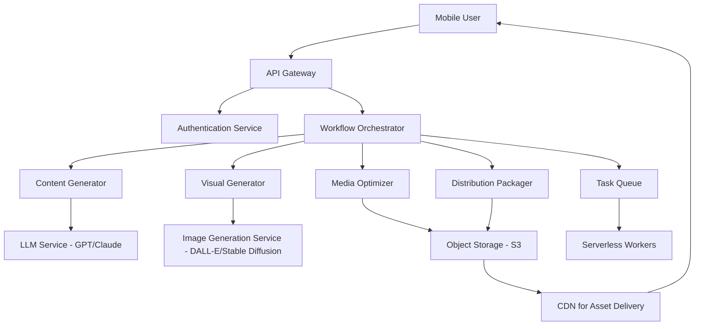

# Design Document: Vani-Bharat

## Overview

Vani-Bharat is a serverless, mobile-first platform that orchestrates AI-powered content generation for regional creators in India. The system integrates multiple AI services (text generation, image generation) with optimization and packaging layers to deliver WhatsApp-ready content from Hinglish or regional language prompts.

The architecture prioritizes:
- Fast response times (≤10 seconds per generation step)
- Low bandwidth consumption through aggressive media optimization
- Mobile-first user experience
- Serverless scalability using managed cloud services
- Modular design for future extensibility

The MVP workflow: User submits Regional_Prompt → Content_Generator produces Localized_Content → Visual_Generator creates marketing image → Media_Optimizer compresses assets → Distribution_Packager creates Share_Package → User downloads/shares via WhatsApp.

## Architecture

### High-Level Architecture



### Technology Stack

**Frontend:**
- React/Next.js for mobile-responsive web interface
- Progressive Web App (PWA) for offline capability
- Tailwind CSS for mobile-first styling

**Backend:**
- AWS Lambda (or equivalent serverless functions) for compute
- API Gateway for REST endpoints
- DynamoDB for user data and session state
- S3 for media storage
- CloudFront CDN for asset delivery
- SQS for async task queuing

**AI Services:**
- OpenAI GPT-4 or Anthropic Claude for text generation
- DALL-E 3 or Stable Diffusion for image generation
- Pre-trained models via API (no custom training required)

**Optimization:**
- Sharp.js or ImageMagick for image compression
- WebP format for optimized delivery

### Deployment Model

Serverless architecture with:
- Auto-scaling based on request volume
- Pay-per-use pricing model
- Regional deployment (Mumbai/Singapore AWS regions for low latency)
- CDN edge caching for static assets

## Components and Interfaces

### 1. API Gateway

**Responsibility:** Entry point for all client requests, handles routing, authentication, and rate limiting.

**Interface:**
```typescript
interface APIGateway {
  // Authenticate user and return session token
  authenticate(credentials: UserCredentials): Promise<AuthToken>
  
  // Route requests to appropriate services
  routeRequest(request: APIRequest): Promise<APIResponse>
  
  // Apply rate limiting per user
  checkRateLimit(userId: string): Promise<boolean>
}

interface UserCredentials {
  email: string
  password: string
}

interface AuthToken {
  token: string
  expiresAt: number
  userId: string
}

interface APIRequest {
  endpoint: string
  method: string
  headers: Record<string, string>
  body: any
}

interface APIResponse {
  statusCode: number
  body: any
  headers: Record<string, string>
}
```

### 2. Workflow Orchestrator

**Responsibility:** Coordinates the multi-step content generation workflow, manages state transitions, and handles errors.

**Interface:**
```typescript
interface WorkflowOrchestrator {
  // Start a new content generation workflow
  startWorkflow(prompt: RegionalPrompt, userId: string): Promise<WorkflowSession>
  
  // Get current workflow status
  getWorkflowStatus(sessionId: string): Promise<WorkflowStatus>
  
  // Execute next step in workflow
  executeNextStep(sessionId: string): Promise<StepResult>
  
  // Cancel workflow
  cancelWorkflow(sessionId: string): Promise<void>
}

interface RegionalPrompt {
  text: string
  sourceLanguage: string  // e.g., "hinglish", "hindi", "tamil"
  targetLanguage?: string // for translation
  contentType: string     // e.g., "social_post", "marketing"
}

interface WorkflowSession {
  sessionId: string
  userId: string
  status: WorkflowStatus
  createdAt: number
  steps: WorkflowStep[]
}

interface WorkflowStatus {
  currentStep: string
  progress: number  // 0-100
  isComplete: boolean
  error?: string
}

interface WorkflowStep {
  name: string
  status: "pending" | "in_progress" | "completed" | "failed"
  result?: any
  error?: string
}

interface StepResult {
  stepName: string
  success: boolean
  data?: any
  error?: string
}
```

### 3. Content Generator

**Responsibility:** Generates localized text content from regional prompts using LLM services, adapts tone for regional audiences.

**Interface:**
```typescript
interface ContentGenerator {
  // Generate localized content from prompt
  generateContent(prompt: RegionalPrompt): Promise<LocalizedContent>
  
  // Translate content between languages
  translateContent(content: string, sourceLang: string, targetLang: string): Promise<string>
  
  // Format content for social media
  formatForSocial(content: LocalizedContent, platform: string): Promise<FormattedContent>
}

interface LocalizedContent {
  text: string
  language: string
  tone: string  // e.g., "casual", "formal", "promotional"
  metadata: {
    wordCount: number
    generatedAt: number
    model: string
  }
}

interface FormattedContent {
  text: string
  platform: string
  formatting: {
    hasEmojis: boolean
    hasHashtags: boolean
    lineBreaks: number
  }
}
```

### 4. Visual Generator

**Responsibility:** Creates marketing images with regional language text overlays using image generation APIs.

**Interface:**
```typescript
interface VisualGenerator {
  // Generate marketing image from content
  generateImage(content: LocalizedContent, style: ImageStyle): Promise<GeneratedImage>
  
  // Add text overlay to image
  addTextOverlay(imageUrl: string, text: string, language: string): Promise<string>
  
  // Validate generated image
  validateImage(imageUrl: string): Promise<ValidationResult>
}

interface ImageStyle {
  theme: string  // e.g., "modern", "traditional", "festive"
  colorScheme: string[]
  aspectRatio: string  // e.g., "1:1", "16:9"
}

interface GeneratedImage {
  imageUrl: string
  width: number
  height: number
  format: string
  sizeBytes: number
  metadata: {
    generatedAt: number
    model: string
    prompt: string
  }
}

interface ValidationResult {
  isValid: boolean
  issues: string[]
  textReadability: number  // 0-100 score
}
```

### 5. Media Optimizer

**Responsibility:** Compresses and optimizes media files for low-bandwidth delivery while maintaining acceptable quality.

**Interface:**
```typescript
interface MediaOptimizer {
  // Optimize image for low bandwidth
  optimizeImage(imageUrl: string, options: OptimizationOptions): Promise<OptimizedMedia>
  
  // Calculate compression ratio
  calculateCompressionRatio(originalSize: number, optimizedSize: number): number
  
  // Validate optimization quality
  validateQuality(originalUrl: string, optimizedUrl: string): Promise<QualityScore>
}

interface OptimizationOptions {
  targetSizeKB?: number
  quality: number  // 1-100
  format: "webp" | "jpeg" | "png"
  maxWidth: number
  maxHeight: number
}

interface OptimizedMedia {
  originalUrl: string
  optimizedUrl: string
  originalSizeBytes: number
  optimizedSizeBytes: number
  compressionRatio: number
  format: string
  dimensions: {
    width: number
    height: number
  }
}

interface QualityScore {
  score: number  // 0-100
  metrics: {
    ssim: number  // Structural similarity
    psnr: number  // Peak signal-to-noise ratio
  }
}
```

### 6. Distribution Packager

**Responsibility:** Packages content and media into WhatsApp-ready share packages with appropriate formatting and constraints.

**Interface:**
```typescript
interface DistributionPackager {
  // Create WhatsApp share package
  createSharePackage(content: FormattedContent, media: OptimizedMedia[]): Promise<SharePackage>
  
  // Validate package meets WhatsApp constraints
  validatePackage(pkg: SharePackage): Promise<ValidationResult>
  
  // Generate shareable link
  generateShareLink(pkg: SharePackage): Promise<string>
}

interface SharePackage {
  packageId: string
  content: FormattedContent
  media: OptimizedMedia[]
  shareUrl: string
  expiresAt: number
  metadata: {
    createdAt: number
    totalSizeBytes: number
    mediaCount: number
  }
}

interface WhatsAppConstraints {
  maxImageSizeMB: number  // 5MB
  maxCaptionLength: number  // 1024 characters
  supportedFormats: string[]  // ["jpeg", "png", "webp"]
  maxImagesPerStatus: number  // 30
}
```

### 7. Storage Service

**Responsibility:** Manages persistent storage of generated content, media, and user data.

**Interface:**
```typescript
interface StorageService {
  // Upload file to storage
  uploadFile(file: Buffer, metadata: FileMetadata): Promise<string>
  
  // Get file URL
  getFileUrl(fileId: string, expiresIn?: number): Promise<string>
  
  // Delete file
  deleteFile(fileId: string): Promise<void>
  
  // Store user session data
  storeSession(sessionId: string, data: WorkflowSession): Promise<void>
  
  // Retrieve user session data
  getSession(sessionId: string): Promise<WorkflowSession>
}

interface FileMetadata {
  fileName: string
  contentType: string
  userId: string
  tags: Record<string, string>
}
```

## Data Models

### User

```typescript
interface User {
  userId: string
  email: string
  passwordHash: string
  profile: {
    name: string
    preferredLanguage: string
    region: string
  }
  createdAt: number
  lastLoginAt: number
  subscription: {
    tier: "free" | "premium"
    creditsRemaining: number
  }
}
```

### Content Generation Request

```typescript
interface ContentRequest {
  requestId: string
  userId: string
  prompt: RegionalPrompt
  status: "pending" | "processing" | "completed" | "failed"
  createdAt: number
  completedAt?: number
  result?: {
    content: LocalizedContent
    images: GeneratedImage[]
    sharePackage: SharePackage
  }
  error?: string
}
```

### Generated Asset

```typescript
interface GeneratedAsset {
  assetId: string
  userId: string
  type: "text" | "image" | "package"
  url: string
  metadata: Record<string, any>
  createdAt: number
  expiresAt: number
  sizeBytes: number
}
```

## Error Handling

### Error Categories

1. **User Input Errors** (4xx)
   - Invalid prompt format
   - Empty or malformed input
   - Unsupported language
   - Rate limit exceeded

2. **Service Errors** (5xx)
   - LLM API timeout or failure
   - Image generation failure
   - Storage service unavailable
   - Optimization failure

3. **Resource Errors**
   - Insufficient credits
   - Storage quota exceeded
   - File size too large

### Error Response Format

```typescript
interface ErrorResponse {
  error: {
    code: string
    message: string
    details?: Record<string, any>
    retryable: boolean
  }
  requestId: string
  timestamp: number
}
```

### Error Handling Strategy

**Retry Logic:**
- Exponential backoff for transient failures (network, API timeouts)
- Maximum 3 retry attempts
- Circuit breaker pattern for external API calls

**Fallback Behavior:**
- If image generation fails, return text-only package
- If optimization fails, return original media with warning
- If translation fails, return content in source language

**User Communication:**
- Clear, non-technical error messages
- Actionable guidance (e.g., "Try a shorter prompt")
- Option to retry or contact support

## Testing Strategy

### Unit Testing

**Focus Areas:**
- Input validation logic
- Content formatting functions
- Media optimization algorithms
- Error handling paths
- Data model validation

**Tools:**
- Jest for JavaScript/TypeScript
- Pytest for Python services
- Mock external API calls

### Property-Based Testing

**Focus Areas:**
- Content generation properties (see Correctness Properties section)
- Media optimization properties
- Workflow state transitions
- Data integrity properties

**Configuration:**
- Minimum 100 iterations per property test
- Use fast-check (JavaScript) or Hypothesis (Python)
- Tag each test with feature name and property number

### Integration Testing

**Focus Areas:**
- End-to-end workflow execution
- API Gateway → Service integration
- Storage service integration
- External API integration (LLM, image generation)

**Approach:**
- Test against staging environment
- Use test fixtures for external APIs
- Validate response times and data formats

### Performance Testing

**Metrics:**
- Content generation latency (target: <10s)
- Image generation latency (target: <10s)
- End-to-end workflow time (target: <30s)
- Concurrent user capacity (target: 100+ users)

**Tools:**
- Artillery or k6 for load testing
- CloudWatch for monitoring
- Synthetic monitoring for uptime

### Mobile Testing

**Focus Areas:**
- Responsive layout on various screen sizes
- Touch interaction usability
- Performance on 3G networks
- PWA offline functionality

**Devices:**
- Test on Android (various screen sizes)
- Test on iOS (iPhone SE to Pro Max)
- Test on low-end devices (2GB RAM)


## Correctness Properties

A property is a characteristic or behavior that should hold true across all valid executions of a system—essentially, a formal statement about what the system should do. Properties serve as the bridge between human-readable specifications and machine-verifiable correctness guarantees.

### Property 1: Content Generation Response Time

*For any* valid Regional_Prompt, the Content_Generator should return Localized_Content within 10 seconds.

**Validates: Requirements 1.1**

### Property 2: Language Translation Support

*For any* valid Hindi content, when translation to Tamil is requested, the Content_Generator should produce Tamil output without errors.

**Validates: Requirements 1.3**

### Property 3: Invalid Input Error Handling

*For any* invalid Regional_Prompt (empty string, null, or malformed input), the Content_Generator should return a descriptive error message and not throw an exception.

**Validates: Requirements 1.5, 6.2**

### Property 4: Social Media Caption Formatting

*For any* Localized_Content, when formatted for social media, the output should contain appropriate line breaks and maintain the original content's key information.

**Validates: Requirements 2.1, 2.2**

### Property 5: Content Length Constraint Compliance

*For any* generated content, when formatted for WhatsApp, the caption length should not exceed 1024 characters (truncating or splitting if necessary).

**Validates: Requirements 2.3**

### Property 6: Image Generation Response Time

*For any* valid content and image style request, the Visual_Generator should return a GeneratedImage within 10 seconds.

**Validates: Requirements 3.1**

### Property 7: Text Overlay Presence

*For any* generated marketing image with Localized_Content, the image should contain visible text overlay elements derived from the content.

**Validates: Requirements 3.2**

### Property 8: Text Overlay Readability

*For any* image with text overlay, the text should have sufficient contrast (WCAG AA minimum) and be positioned within image bounds.

**Validates: Requirements 3.3**

### Property 9: Image Generation Error Handling

*For any* image generation request that fails, the Visual_Generator should return a descriptive error message without crashing.

**Validates: Requirements 3.5**

### Property 10: Image Compression Ratio

*For any* generated image, after optimization, the file size should be reduced by at least 50% compared to the original.

**Validates: Requirements 4.1**

### Property 11: Optimized Image Load Time

*For any* optimized image, the file size should be small enough to load within 5 seconds on a 2G network (approximately ≤100KB for typical 2G speeds).

**Validates: Requirements 4.3**

### Property 12: Optimization Fallback Behavior

*For any* image where optimization fails, the Media_Optimizer should return the original image URL along with a warning message.

**Validates: Requirements 4.5**

### Property 13: Share Package Completeness

*For any* completed workflow, the Share_Package should contain both the FormattedContent and at least one OptimizedMedia item.

**Validates: Requirements 5.1**

### Property 14: WhatsApp Specification Compliance

*For any* Share_Package, all included images should meet WhatsApp specifications: file size ≤5MB and format in ["jpeg", "png", "webp"].

**Validates: Requirements 5.2, 5.3**

### Property 15: Share Link Generation

*For any* created Share_Package, a valid shareable URL should be generated and accessible.

**Validates: Requirements 5.4**

### Property 16: Multi-Image Sequence Constraints

*For any* Share_Package with multiple images, the total number of images should not exceed 30 (WhatsApp Status limit).

**Validates: Requirements 5.5**

### Property 17: Input Validation Execution

*For any* user input submission, validation should occur before processing begins, rejecting invalid inputs immediately.

**Validates: Requirements 6.1**

### Property 18: Error Logging

*For any* system error in any subsystem, an error log entry should be created with timestamp, error type, and context details.

**Validates: Requirements 6.3**

### Property 19: User-Friendly Error Messages

*For any* error returned to users, the error message should not contain stack traces, internal variable names, or system paths.

**Validates: Requirements 6.4**

### Property 20: Network Timeout Handling

*For any* network timeout during external API calls, the system should return a graceful error message with retry guidance.

**Validates: Requirements 6.5**

### Property 21: Mobile Layout Activation

*For any* viewport width less than 768px, the system should apply mobile-optimized CSS classes and layout.

**Validates: Requirements 7.1**

### Property 22: Touch Target Sizing

*For any* interactive UI element (buttons, links, inputs), the minimum touch target size should be at least 44px × 44px.

**Validates: Requirements 7.3**

### Property 23: Responsive Layout Adaptation

*For any* screen size between 320px and 1920px width, the layout should adapt without horizontal scrolling or content overflow.

**Validates: Requirements 7.4**

### Property 24: Interface Load Time

*For any* initial page load under simulated 3G network conditions, the interface should become interactive within 3 seconds.

**Validates: Requirements 7.5**

### Property 25: Workflow Step Progression

*For any* workflow session, the steps should execute in the correct order: prompt input → content generation → visual generation → optimization → packaging.

**Validates: Requirements 8.1**

### Property 26: Progress Indicator Updates

*For any* workflow step completion, the progress indicator should update to reflect the new state and enable the next step.

**Validates: Requirements 8.2**

### Property 27: End-to-End Workflow Time

*For any* complete workflow execution from prompt submission to Share_Package creation, the total time should not exceed 30 seconds.

**Validates: Requirements 8.4**

### Property 28: Individual Step Regeneration

*For any* workflow session, any individual step should be re-executable without requiring restart of the entire workflow.

**Validates: Requirements 8.5**

### Property 29: Data Deletion Compliance

*For any* user-initiated content deletion, all associated data (content, images, packages) should be removed from storage within 24 hours.

**Validates: Requirements 9.4**

### Property 30: Authentication Enforcement

*For any* protected API endpoint, requests without valid authentication tokens should be rejected with 401 Unauthorized status.

**Validates: Requirements 9.5**

### Property 31: Concurrent User Performance

*For any* load scenario with up to 100 concurrent users, the average response time for content generation should remain within 10 seconds.

**Validates: Requirements 10.1, 10.4**

### Property 32: Request Queueing Under Load

*For any* system state where active requests exceed capacity, new requests should be queued and users should receive estimated wait time information.

**Validates: Requirements 10.3**

### Property 33: Request Prioritization

*For any* resource-constrained state, active user requests should be processed before background cleanup or maintenance tasks.

**Validates: Requirements 10.5**
